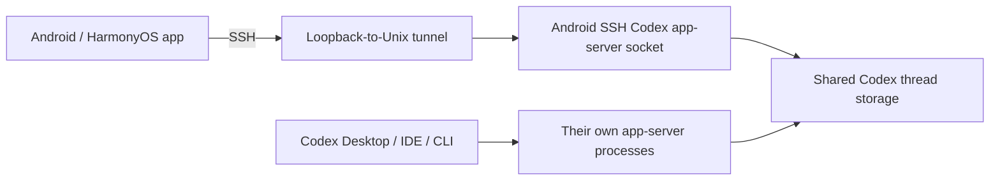

# Android SSH Codex

Android SSH Codex is a mobile Codex UI for Android and OpenHarmony/HarmonyOS.
Codex stays on your development machine; the app connects through SSH, starts a
namespaced persistent app-server, and renders its threads, turns, approvals, and
streamed activity in a mobile workspace.

## Scope

- Android 8+ APK/AAB and OpenHarmony arm64 HAP builds.
- Password and pasted OpenSSH private-key authentication.
- `~/.ssh/config` import for `Host`, `HostName`, `User`, `Port`, `IdentityFile`,
  `SetEnv`, wildcards, negated patterns, and one-hop `ProxyJump`.
- Trust-on-first-use host-key pinning with hard mismatch warnings.
- Existing and running remote Codex tasks, search, history, streaming output,
  new/resumed turns, interrupt, and approvals.
- Race-safe snapshot/event merging and read-only display for tasks currently
  owned by Codex Desktop, an IDE, the CLI, or another mobile client.

It does not run Codex on the phone, proxy traffic through a cloud service, store
OpenAI credentials, provide a source editor, or manage Git hosting.

## How it coexists with Codex Desktop



The app-owned endpoint is always
`~/.cache/android-ssh-codex/app-server.sock` (or the matching XDG cache path).
Startup uses an atomic directory lock. When a profile's environment changes,
the app validates the recorded PID, command, and socket before restarting only
its own app-server so the new values take effect. Other Codex app-server sockets
are outside this namespace and are never touched.

Task refreshes and live notifications pass through one reducer with connection
epochs, refresh generations, and event revisions. A running thread is writable
only when this device previously created or resumed it and the app-owned server
still reports it loaded. Every other running thread remains visible and read-only.

## Install and connect

1. Download the APK or HAP and its checksum from
   [Releases](https://github.com/wkj2333666/Android-SSH-Codex/releases).
2. On the remote host, install and authenticate a current Codex CLI.
3. Add a host manually or paste relevant `~/.ssh/config` contents.
4. Attach the private key text or password. Imported `IdentityFile` paths are
   hints because those files live on the machine from which the config came. An
   empty passphrase works with unencrypted private keys.
5. Connect, verify the presented SSH fingerprint, then open or create a task.

`SetEnv` assignments are imported from SSH config and can also be edited under
**Advanced SSH** as one `NAME=value` assignment per line. For example:

```sshconfig
Host pi
  HostName 192.0.2.10
  User codex
  SetEnv LC_CODEX_BACKEND=sub2api
```

The SSH server must accept every requested name. Add the names, not their
values, to the server's `sshd_config`, then reload SSH according to the remote
operating system:

```text
AcceptEnv LC_CODEX_BACKEND
```

If the server rejects a name, the app reports the required `AcceptEnv` entry
without displaying its configured value. Arbitrary SSH directives are not
applied by the app; in particular, `IPQoS` remains unsupported.

Secrets and pinned fingerprints use the platform secure-storage implementation.
SSH and Codex RPC input are not logged by the app. Daemon reuse records only a
SHA-256 environment fingerprint, never environment values.

## Development

See [the product design](docs/superpowers/specs/2026-07-31-android-ssh-codex-design.md),
[implementation plan](docs/superpowers/plans/2026-07-31-android-ssh-codex.md),
and [build guide](docs/BUILDING.md).

All builds and tests run on GitHub Actions. This repository is MIT licensed.
